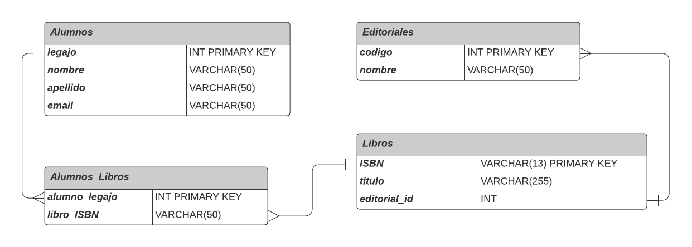

# Modelo Entidad-Relación

## Entidades

### Alumnos
- Atributos: legajo (PK), nombre, apellido, email

### Editoriales
- Atributos: código (PK), nombre

### Libros
- Atributos: ISBN (PK), título, editorial_id (FK)

## Relaciones

- La entidad "Libros" tiene una relación con la entidad "Editoriales" a través de la clave foránea "editorial_id," que se relaciona con el atributo "código" de la entidad "Editoriales."

- Para representar la relación de muchos a muchos entre los alumnos y los libros que han leído, se ha creado una tabla intermedia llamada "Alumnos_Libros":
  - Alumnos_Libros
    - Atributos: alumno_legajo (FK), libro_ISBN (FK)
    - Establece relaciones entre "Alumnos" y "Libros" a través de las claves foráneas "alumno_legajo" y "libro_ISBN."


# Script SQL

## Creación de tablas

```sql
CREATE TABLE Alumnos (
    legajo INT PRIMARY KEY,
    nombre VARCHAR(50),
    apellido VARCHAR(50),
    email VARCHAR(100)
);

CREATE TABLE Editoriales (
    codigo INT PRIMARY KEY,
    nombre VARCHAR(100)
);

CREATE TABLE Libros (
    ISBN VARCHAR(13) PRIMARY KEY,
    título VARCHAR(255),
    editorial_id INT,
    FOREIGN KEY (editorial_id) REFERENCES Editoriales(codigo)
);

CREATE TABLE Alumnos_Libros (
    alumno_legajo INT,
    libro_ISBN VARCHAR(13),
    FOREIGN KEY (alumno_legajo) REFERENCES Alumnos(legajo),
    FOREIGN KEY (libro_ISBN) REFERENCES Libros(ISBN)
);

INSERT INTO Alumnos (legajo, nombre, apellido, email)
VALUES (1, 'Milagros', 'Flores', 'miliflo@ejemplo.com.ar');

INSERT INTO Editoriales (codigo, nombre)
VALUES (101, 'Editorial A');

INSERT INTO Libros (ISBN, título, editorial_id)
VALUES ('9780123456789', 'Libro 1', 101);

INSERT INTO Alumnos_Libros (alumno_legajo, libro_ISBN)
VALUES (1, '9780123456789');


```

## Modelo Entidad Relacion



